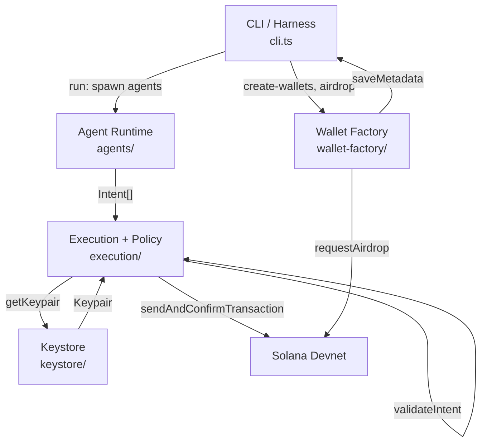
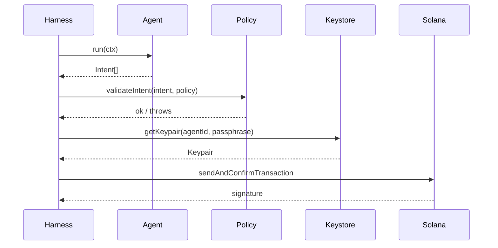

# Aegis

**Secure Autonomous Wallet Infrastructure for AI Agents on Solana**

Its a modular wallet framework for AI agents on Solana. handles programmatic wallet creation, automatic transaction signing, SOL and SPL token support, and multi-agent simulation, all on devnet with a clean separation between agent logic and wallet execution.

Three LLM-powered agents (Sentinel, Trader, Experimental) each run on OpenAI with different models, temperatures, and risk profiles. every LLM output goes through a 3-layer validation firewall (Zod schema, risk profile, execution policy) before anything gets signed.

## Bounty compliance

| Requirement | Status |
|-------------|--------|
| Create wallet programmatically | `create-wallets` |
| Sign transactions automatically | execution layer, no manual input |
| Hold SOL or SPL tokens | SOL + SPL mint/transfer via `spl-setup` / `spl-transfer` |
| Interact with test dApp/protocol | Anchor counter program, `init-test-program` + agent `increment` |
| Deep dive (written) | [DEEP_DIVE.md](./DEEP_DIVE.md) |
| Open-source, README, setup | yes |
| SKILLS.md for agents | [SKILLS.md](./SKILLS.md) |
| Working prototype on devnet | yes |
| Safe key management | encrypted keystore, keys never reach the agent layer |
| Automated signing | yes |
| Simulate AI agent decision-making | TraderAgent, LiquidityAgent, ConservativeAgent, DeFiTraderAgent |
| Clear separation (agent vs wallet) | agents produce intents only, execution layer signs |
| Multi-agent, scalable | one wallet per agent, configurable N |
| Structured logging / observability | timestamp + level + JSON fields on every event |
| Fetch token balances | `balance` shows SOL + all SPL token accounts |
| BaseAgent class + strategy abstraction | `BaseAgent`, `AGENT_CLASSES` registry |
| Configurable agent behavior | `.aegis/config/<agentId>.json` per-agent strategy + cap |
| LLM-powered autonomous agents | Sentinel, Trader, Experimental via OpenAI |
| Swappable LLM provider | `LLMProvider` interface with OpenAI and MockProvider |
| Intent validation firewall | Zod schema + risk profile + execution policy (3 layers) |
| Agent memory / decision log | NDJSON per agent in `.aegis/memory/` |
| Monitoring API | Express `/api/state`, `/api/history/:agentId` |
| Security documentation | [SECURITY.md](./SECURITY.md) |

## Possible directions (bounty)

| Direction | How Aegis covers it |
|-----------|---------------------|
| **Autonomous wallet that executes scripted trades for a test DeFi protocol** | The test program includes a `trade(amount)` instruction. **DeFiTraderAgent** executes scripted trades against it and the wallet signs without human input. Run `init-trades` once after deploy, then `run`. |
| **Wallet integrated with a local AI agent simulation (trading bot, liquidity provider)** | **TraderAgent** does SOL transfers, **LiquidityAgent** alternates transfers and protocol calls, **ConservativeAgent** sticks to protocol only. The same intent/execution pipeline works with LLMs or any other AI. |
| **Test harness showing multiple agents each managing their own wallets** | `create-wallets` creates N agent keypairs. `run` runs all N agents in sequence, each with its own wallet, metadata, and keystore. No shared keys. |
| **CLI to observe agent wallet actions** | `balance` shows SOL per agent. `run` logs each tx signature per agent. |

## Features

- programmatic wallet creation
- encrypted keystore with passphrase protection
- automatic transaction signing
- multi-agent support with isolated wallets
- intent-based agent architecture
- **LLM agents** — Sentinel (conservative, gpt-4o-mini t=0.1), Trader (strategic, gpt-4o t=0.5), Experimental (adaptive, gpt-4o-mini t=0.9 or MockProvider)
- **provider abstraction** — swappable LLM backends via `LLMProvider` interface
- **3-layer intent firewall** — Zod schema validation, risk profile enforcement, execution policy
- **memory store** — NDJSON decision log per agent with full reasoning, confidence, and rejection history
- **monitoring API** — Express server at `/api/state` and `/api/history/:agentId`
- **SPL token** — mint, hold, and transfer tokens between agents
- **intent validation** — recipient/program allowlists and transfer cap to mitigate prompt injection
- devnet deployment ready

## Requirements

- Node.js 20+
- npm or yarn
- OpenAI API key (Sentinel + Trader need it; Experimental falls back to MockProvider without it)
- Anchor CLI (only needed if you want to deploy the test program)

## Setup

1. clone the repo
```bash
git clone <repo-url>
cd aegis
```

2. install dependencies
```bash
npm install
```

3. configure environment
```bash
cp env.example .env
# required: KEYSTORE_PASSPHRASE
# for LLM agents: OPENAI_API_KEY=sk-...
# optional: AEGIS_TEST_PROGRAM_ID, LLM_INTERVAL_MS
```

4. build
```bash
npm run build
```

## Usage

### create agent wallets

```bash
npm run create-wallets -- --agents 5
```

### deploy test program (optional)

only needed if you want agents to interact with the on-chain counter/trade program:
```bash
cd test-program
anchor build
anchor deploy --provider.cluster devnet
# copy the program ID and set AEGIS_TEST_PROGRAM_ID in .env
cd ..
npm run init-test-program
```

### run multi-agent simulation

```bash
npm run run -- --agents 5 --rounds 3
```

### check balances (SOL + SPL tokens)

```bash
npm run balance
```

### per-agent config (optional)

override strategy and transfer cap for a specific agent:
```bash
node dist/cli.js config-agent --agent agent_0 --strategy defiTrader --max-lamports 2000000
```
config is saved to `.aegis/config/agent_0.json` and picked up on the next `run`.

### SPL tokens

create a test mint, mint tokens to an agent, then transfer between agents:
```bash
npm run spl-setup          # create mint, mint to agent_0
npm run spl-transfer       # transfer 100 from agent_0 to agent_1 (use -f/-t/-n to customize)
```

### LLM agents (Sentinel, Trader, Experimental)

start the autonomous LLM agent scheduler:
```bash
npm run llm-run                          # runs every 30s until Ctrl+C
npm run llm-run -- --interval 10000      # faster ticks (10s)
npm run llm-run-once                     # single tick then exit, good for testing
```

each agent calls OpenAI, validates the response through Zod + risk profile + execution policy, then signs and submits. all decisions including rejections and reasoning are logged to `.aegis/memory/<agentId>.ndjson`.

start the monitoring API:
```bash
npm run serve    # starts Express on http://localhost:3000
# GET /api/state          -- all agents, balances, recent history
# GET /api/history/:id    -- full decision log for one agent
```

**Agent profiles:**

| Agent | Model | Temp | Max per tx | Allowed actions |
|-------|-------|------|-----------|----------------|
| Aegis Sentinel | gpt-4o-mini | 0.1 | 10% | transfer, hold |
| Aegis Trader | gpt-4o | 0.5 | 40% | transfer, callProgram, hold |
| Aegis Experimental | gpt-4o-mini | 0.9 | 20% | transfer, callProgram, hold |

experimental falls back to `MockProvider` (local deterministic responses) when `OPENAI_API_KEY` is not set, which shows the intelligence layer is genuinely swappable.

### Quick demo (for judges)

with `.env` configured (`KEYSTORE_PASSPHRASE`, and optionally `AEGIS_TEST_PROGRAM_ID` if you deployed the test program):

```bash
npm install && npm run build
npm run create-wallets -- --agents 3
npm run airdrop             # if airdrops failed during create-wallets
npm run spl-setup           # SPL: mint + hold
npm run spl-transfer        # SPL: transfer between agents
npm run init-test-program   # if test program deployed
npm run init-trades         # if test program deployed (for DeFi scripted trades)
npm run run -- --agents 3 --rounds 2
npm run balance
```

you should see wallets created, SOL balances, SPL mint/transfer txs, agent txs (SOL transfers, counter increments, DeFi `trade` calls), and final balances.

## Architecture

split into four layers:

1. **Wallet Factory** — creates keypairs, manages metadata, handles airdrops
2. **Key Management** — encrypted keystore with AES-256-GCM, passphrase-based encryption
3. **Agent Runtime** — scripted agents (TraderAgent, LiquidityAgent, ConservativeAgent, DeFiTraderAgent) that produce transaction intents
4. **Execution Layer** — converts intents to transactions, validates against policy, signs, and submits to devnet

agents never touch private keys. they produce intents (transfer SOL, call program), and the execution layer handles the rest.



**Data flow for a single agent action:**



## Test Program (test DeFi protocol)

the included Anchor program (`test-program/`) is a minimal test DeFi protocol:

- **Counter** — `init_counter`, `increment` (lets agents interact with a simple on-chain dApp)
- **Trades** — `init_trades`, `trade(amount)` (agents submit trade amounts; state records count and last amount)

deploy to devnet, set `AEGIS_TEST_PROGRAM_ID` in `.env`, then run `init-test-program` and `init-trades` once. after that, `run` uses Trader, Liquidity, Conservative, and DeFiTrader agents; DeFiTrader executes scripted `trade(amount)` calls against the program.

## Security

- keys stored encrypted (AES-256-GCM) with passphrase
- keys never exposed to the agent logic layer
- devnet-only (no mainnet risk)
- one wallet per agent, no shared state
- **intent validation before execution** (allowlists + caps to reduce prompt injection / scam risk):
  - **Recipient allowlist** — transfers only go to known agent wallets from metadata. Unknown addresses are rejected.
  - **Program allowlist** — only System Program and the test program (plus any `ALLOWED_PROGRAM_IDS`) can be called. Unknown programs are rejected.
  - **Transfer cap** — max lamports per transfer set by `MAX_TRANSFER_LAMPORTS` (default 1 SOL). Larger transfers are rejected.
- every intent is validated against this policy before signing; invalid intents are rejected with a clear error.

## Project Structure

```
src/
  wallet-factory/     # wallet creation, metadata, airdrops
  keystore/           # AES-256-GCM encryption, key storage
  agents/             # intent definitions, BaseAgent, scripted agents, per-agent config
  agents/llm/         # LLM-powered agents (Sentinel, Trader, Experimental, registry)
  execution/          # intent -> transaction -> policy -> submit
  llm/                # LLMProvider interface, OpenAI impl, MockProvider, Zod schema, prompts
  memory/             # NDJSON decision log per agent
  logger.ts           # structured logger (timestamp + level + JSON fields)
  scheduler.ts        # interval-based LLM agent runner
  api.ts              # Express monitoring API
  test-program-client.ts
  cli.ts              # command-line interface
test-program/         # Anchor counter + DeFi trade program
.aegis/
  keystore/           # encrypted keypair files (agent_*.enc)
  meta/               # agents.json, spl-mint.json
  config/             # per-agent JSON config (agent_0.json, etc.)
  memory/             # per-agent NDJSON decision logs
```

## Environment Variables

- `KEYSTORE_PASSPHRASE` — required, passphrase for keystore encryption
- `OPENAI_API_KEY` — required for Sentinel + Trader; Experimental uses MockProvider without it
- `RPC_URL` — optional, defaults to devnet
- `AEGIS_TEST_PROGRAM_ID` — optional, set after deploying the test program
- `MAX_TRANSFER_LAMPORTS` — optional, max lamports per transfer (default: 1e9 = 1 SOL)
- `ALLOWED_PROGRAM_IDS` — optional, comma-separated extra allowed program IDs
- `LLM_INTERVAL_MS` — optional, scheduler tick interval in ms (default: 30000)
- `LOG_LEVEL` — optional, debug / info / warn / error (default: info)
- `API_PORT` — optional, monitoring API port (default: 3000)

## License

MIT
